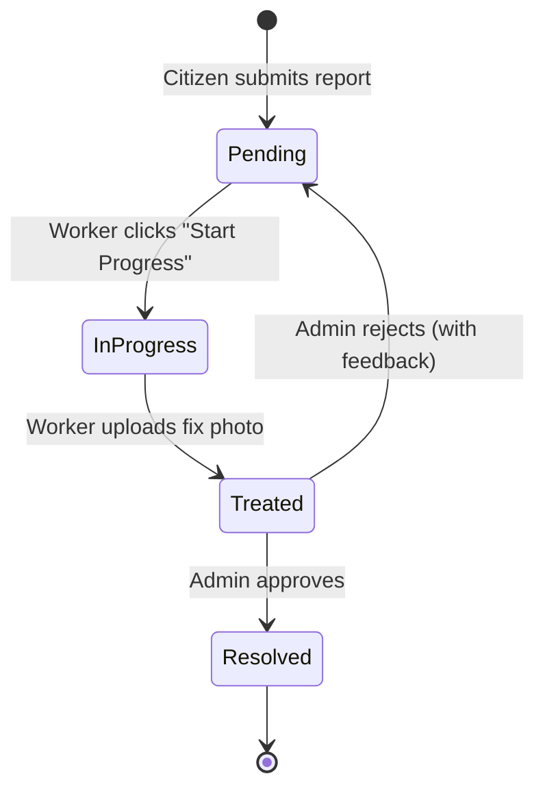

<p align="center">
  
  
  
  
  
</p>

<h1 align="center">CivicPulse</h1>

<p align="center">
  <b>A real-time infrastructure reporting platform where citizens report, workers resolve, and administrators oversee — all in one seamless pipeline.</b>
</p>

<p align="center">
  <em>Built by Team Nexus</em>
</p>

---

## Overview

**CivicPulse** is a mobile-first, full-stack web application for civic infrastructure management. Citizens can anonymously report issues like potholes, broken streetlights, and flooding. Field workers pick up tasks, upload fix evidence, and administrators approve resolutions — creating a complete, transparent lifecycle from report to resolution.

### Key Highlights

- **Zero-friction reporting** — No login required for citizens. Snap a photo, capture GPS, submit.
- **Real-time dashboards** — Live incident heatmap and status-filtered feeds powered by Supabase real-time subscriptions.
- **Worker task management** — Shared queue model with status lifecycle (Pending → In-Progress → Treated → Resolved).
- **Admin oversight** — Click-to-inspect detail modals with before/after photo comparison, embedded maps, and approve/reject workflows.
- **Premium visual design** — M3 Expressive design language with WebGL animated backgrounds (Aurora, FloatingLines), glassmorphism, and micro-animations.

---

## Architecture

```
┌─────────────────────────────────────────────────────────────┐
│                        FRONTEND                             │
│  Next.js 16 (App Router) + React 19 + Tailwind CSS 4       │
│                                                             │
│  ┌──────────┐ ┌──────────┐ ┌──────────┐ ┌──────────┐       │
│  │ Citizen   │ │Authority │ │ Worker   │ │  Admin   │       │
│  │ /citizen  │ │/authority│ │ /worker  │ │  /admin  │       │
│  │           │ │          │ │          │ │          │       │
│  │ Report    │ │ Heatmap  │ │ Task     │ │ Review   │       │
│  │ Form +   │ │ + List   │ │ Queue +  │ │ Modal +  │       │
│  │ Map Pick  │ │ View     │ │ Lightbox │ │ Approve  │       │
│  └──────────┘ └──────────┘ └──────────┘ └──────────┘       │
│                        │                                    │
│              React Query (TanStack)                         │
│            Auto-refresh + Optimistic UI                     │
└────────────────────────┬────────────────────────────────────┘
                         │
                         ▼
┌─────────────────────────────────────────────────────────────┐
│                       BACKEND                               │
│                  Supabase (BaaS)                            │
│                                                             │
│  ┌──────────────┐  ┌───────────┐  ┌──────────────────┐     │
│  │  PostgreSQL   │  │  Auth     │  │  Storage          │     │
│  │  + RLS        │  │  (Email/  │  │  report-images    │     │
│  │  + Indexes    │  │  Password)│  │  fix-images       │     │
│  └──────────────┘  └───────────┘  └──────────────────┘     │
│                                                             │
│  API Routes: /api/admin/approve, /api/admin/reassign        │
│  (Service Role key for RLS bypass on admin actions)         │
└─────────────────────────────────────────────────────────────┘
```

---

## Portals

### 1. Citizen Portal (`/citizen`)

> **No login required.** Anonymous infrastructure reporting in under 30 seconds.

| Feature | Details |
|---------|---------|
| Photo Upload | Camera/gallery with live preview, JPEG/PNG/HEIC support |
| GPS Location | Auto-detect via browser Geolocation API |
| Manual Map Picker | Interactive Leaflet map for manual pin placement |
| Issue Categories | Pothole, Broken Streetlight, Flooding, Fallen Tree, Garbage, Water Leak, etc. |
| Description | Free-text with 500-char limit and live counter |

### 2. Authority Dashboard (`/authority`)

> **Live operational overview** with geospatial intelligence.

| Feature | Details |
|---------|---------|
| Interactive Heatmap | Leaflet + leaflet.heat showing incident density clusters |
| Status Markers | Color-coded pins (Red: Pending, Amber: In-Progress, Green: Resolved) |
| List View | Tabular report browser at `/authority/list` with full details |
| Real-time | Auto-refreshes every 30 seconds via React Query |

### 3. Worker Portal (`/worker`)

> **Authenticated task management** for field workers.

| Feature | Details |
|---------|---------|
| Session Auth | Supabase email/password login with sessionStorage (expires on tab close) |
| Shared Queue | All pending/in-progress tasks visible to all workers |
| Status Filters | All, Pending, In-Progress, Marked as Done tabs |
| Task Actions | "Start Progress" → Upload fix photo → "Mark as Done" |
| Lightbox | Full-screen image viewer with pinch-to-zoom |
| Location Map | Integrated mini-map showing report coordinates |

### 4. Admin Panel (`/admin`)

> **Approval workflow** with full inspection capabilities.

| Feature | Details |
|---------|---------|
| Status Filters | All, Pending, In-Progress, Marked as Done, Resolved |
| Card Grid | 3-column clickable cards with split before/after thumbnails |
| Detail Modal | Full-size images, mini-map, metadata, admin notes |
| Approve | Marks report as "Resolved" (one-click) |
| Reject | Sends back to worker with feedback note |
| Before/After | Side-by-side photo comparison with centered "VS" divider |

---

## Report Lifecycle



| Status | DB Value | Description |
|--------|----------|-------------|
| **Pending** | `Pending` | Freshly submitted, awaiting worker |
| **In-Progress** | `In-Progress` | Worker has picked up the task |
| **Treated** | `In-Progress` + `fix_image_url` | Worker uploaded fix evidence (virtual status) |
| **Resolved** | `Resolved` | Admin approved the resolution |
| **Rejected** | `Pending` (reset) | Admin sent back with feedback |

---

## Tech Stack

| Layer | Technology | Purpose |
|-------|-----------|---------|
| **Framework** | Next.js 16 (App Router) | Server/client rendering, routing, API routes |
| **UI** | React 19 + Tailwind CSS 4 | Component architecture + utility-first styling |
| **State** | TanStack React Query | Server state, caching, auto-refresh |
| **Database** | Supabase PostgreSQL | Managed database with Row-Level Security |
| **Auth** | Supabase Auth | Email/password for workers, sessionStorage persistence |
| **Storage** | Supabase Storage | Public buckets for report and fix images |
| **Maps** | Leaflet + react-leaflet | Interactive maps, heatmaps, location picker |
| **Icons** | Lucide React | Consistent icon system |
| **Animations** | OGL (Aurora), Three.js (FloatingLines) | WebGL animated backgrounds |
| **Toasts** | Sonner | Notification system |
| **Dates** | date-fns | Relative time formatting |

---

## Getting Started

### Prerequisites

- **Node.js** ≥ 18
- **npm** ≥ 9
- **Supabase** project (free tier works)

### 1. Clone & Install

```bash
git clone https://github.com/your-org/civicpulse.git
cd civicpulse
npm install
```

### 2. Configure Environment

Create `.env.local` in the project root:

```env
NEXT_PUBLIC_SUPABASE_URL=https://your-project.supabase.co
NEXT_PUBLIC_SUPABASE_ANON_KEY=your-anon-key
SUPABASE_SERVICE_ROLE_KEY=your-service-role-key
```

> **Note:** The `SUPABASE_SERVICE_ROLE_KEY` is used server-side only in `/api/admin/*` routes for RLS bypass.

### 3. Initialize Database

Run the schema in your Supabase SQL Editor:

```bash
# Copy and paste the contents of:
supabase/schema.sql
```

This creates:
- `reports` table with RLS policies
- `report-images` and `fix-images` storage buckets
- Performance indexes on `status`, `worker_id`, `created_at`, and `(lat, long)`

### 4. Run Development Server

```bash
npm run dev
```

Open [http://localhost:3000](http://localhost:3000) to see the landing page.

### 5. Production Build

```bash
npm run build
npm start
```

---

## Project Structure

```
civicpulse/
├── app/
│   ├── page.tsx              # Landing page (Aurora background + role cards)
│   ├── layout.tsx            # Root layout (fonts, providers, Sonner)
│   ├── providers.tsx         # React Query provider
│   ├── globals.css           # Design system (glass, animations, variables)
│   ├── citizen/
│   │   └── page.tsx          # Citizen report form portal
│   ├── authority/
│   │   ├── page.tsx          # Heatmap dashboard
│   │   ├── layout.tsx        # Authority layout
│   │   └── list/page.tsx     # Tabular report list
│   ├── worker/
│   │   └── page.tsx          # Worker task queue (auth-gated)
│   ├── admin/
│   │   └── page.tsx          # Admin review panel
│   └── api/admin/
│       ├── approve/route.ts  # POST: Approve report (service role)
│       └── reassign/route.ts # POST: Reject + send feedback
├── components/
│   ├── Aurora.tsx            # WebGL aurora background (OGL)
│   ├── FloatingLines.tsx     # WebGL floating lines background (Three.js)
│   ├── Prism.tsx             # WebGL prism background (OGL)
│   ├── ReportForm.tsx        # Citizen report form
│   ├── MapPicker.tsx         # Interactive map location picker modal
│   ├── MiniMap.tsx           # Compact non-interactive map
│   ├── IncidentMap.tsx       # Heatmap + markers for authority dashboard
│   ├── WorkerTaskCard.tsx    # Worker task card with lightbox
│   ├── AdminDetailModal.tsx  # Admin report inspection modal
│   ├── AdminReviewCard.tsx   # Admin review card (legacy)
│   ├── StatusBadge.tsx       # Color-coded status pill
│   ├── ReportTable.tsx       # Tabular report view
│   └── LocationMiniMap.tsx   # Embedded location map
├── lib/
│   ├── queries.ts            # React Query hooks (all data operations)
│   ├── types.ts              # TypeScript interfaces + status enums
│   ├── utils.ts              # Utility functions (cn)
│   └── supabase/
│       ├── client.ts         # Browser Supabase client (sessionStorage)
│       └── server.ts         # Server Supabase client (cookies)
├── supabase/
│   └── schema.sql            # Database schema + RLS policies
└── public/                   # Static assets
```

---

## Database Schema

```sql
CREATE TABLE reports (
  id            UUID PRIMARY KEY DEFAULT gen_random_uuid(),
  created_at    TIMESTAMPTZ NOT NULL DEFAULT now(),
  description   TEXT NOT NULL,
  category      TEXT NOT NULL DEFAULT 'Other',
  image_url     TEXT,           -- Citizen-uploaded photo
  fix_image_url TEXT,           -- Worker-uploaded fix photo
  status        report_status NOT NULL DEFAULT 'Pending',
  lat           DECIMAL(10,7) NOT NULL,
  long          DECIMAL(10,7) NOT NULL,
  worker_id     UUID REFERENCES auth.users(id),
  admin_note    TEXT            -- Rejection feedback
);
```

### Storage Buckets

| Bucket | Access | Purpose |
|--------|--------|---------|
| `report-images` | Public upload + read | Citizen photo evidence |
| `fix-images` | Auth upload, public read | Worker fix documentation |

---

## Design System

### Visual Language

- **Theme** — Dark mode with `oklch` color space tokens
- **Glassmorphism** — `.glass`, `.glass-hover`, `.glass-frost` utility classes
- **Typography** — Space Grotesk (headings), Inter (body) via Google Fonts
- **Animations** — `slide-up`, `fade-in` keyframes + CSS transitions
- **WebGL Backgrounds** — Aurora (landing), FloatingLines (worker login)

### Color Palette

| Role | Color | Usage |
|------|-------|-------|
| Citizen | `blue-500` | Report form, GPS buttons |
| Authority | `violet-500` | Map dashboard, overview |
| Worker | `amber-500` | Task cards, login theme |
| Admin | `emerald-500` | Approval actions, resolved |
| Danger | `red-500` | Rejection, errors |
| Treated | `cyan-500` | Marked as done status |

---

## Security

| Concern | Implementation |
|---------|---------------|
| **Anonymous Reporting** | Anon Supabase key allows INSERT without auth |
| **RLS (Row-Level Security)** | All table operations gated by Postgres policies |
| **Worker Auth** | Supabase email/password with `sessionStorage` (no persistent login) |
| **Admin Actions** | Server-side API routes using `SUPABASE_SERVICE_ROLE_KEY` to bypass RLS |
| **Storage** | Separate buckets with distinct upload permissions |

---

## Deployment

### Vercel (Recommended)

1. Push your repo to GitHub
2. Import into [Vercel](https://vercel.com)
3. Set environment variables:
   - `NEXT_PUBLIC_SUPABASE_URL`
   - `NEXT_PUBLIC_SUPABASE_ANON_KEY`
   - `SUPABASE_SERVICE_ROLE_KEY`
4. Deploy — Vercel auto-detects Next.js

> **Important:** Ensure your production domain uses HTTPS for browser Geolocation API to work without fallback coordinates.

---

## API Reference

### `POST /api/admin/approve`

Approves a treated report and sets status to `Resolved`.

```json
{ "reportId": "uuid-string" }
```

### `POST /api/admin/reassign`

Rejects a report and resets it to `Pending` with admin feedback.

```json
{
  "reportId": "uuid-string",
  "adminNote": "Repair is incomplete — pothole edge still exposed."
}
```

---

## License

This project was built for a hackathon. Adapt freely.

<p align="center">
  <b>Built with ❤ by Team Nexus</b>
</p>
